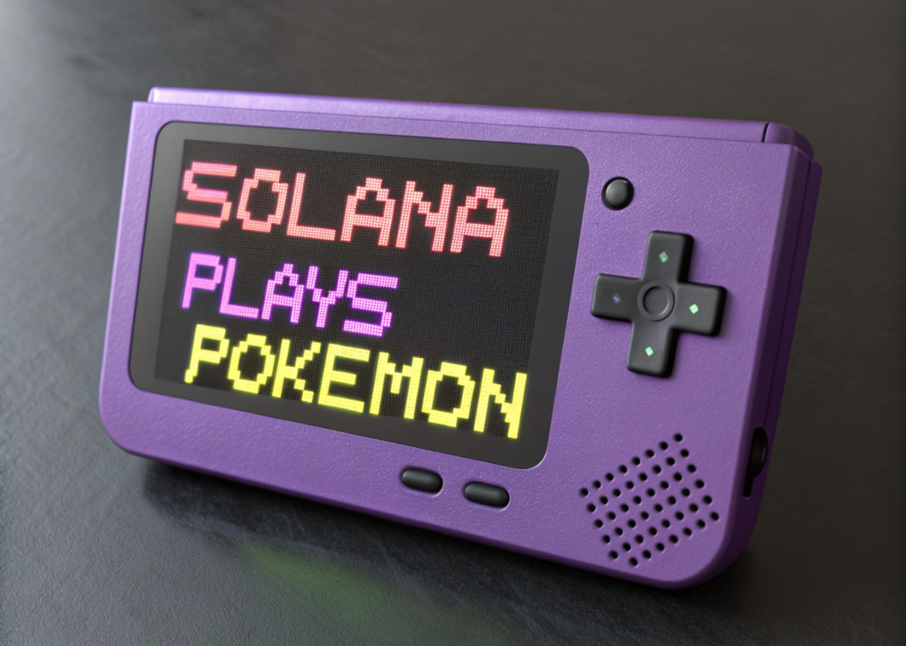

# Solana Plays Pokemon Rewards Program



The Solana Plays Pokemon (SPP) Rewards Program is a native Solana program that enables transparent and efficient distribution of community rewards. It allows project administrators to manage and distribute SPL tokens to active community members, fostering engagement and participation within the SPP ecosystem.

## Overview

The program implements a secure vault system that:

- Safely stores community rewards tokens
- Enables authorized distribution to community members
- Maintains transparent operation through on-chain transactions
- Utilizes Solana's native speed and security

## Program Instructions

### 1. Initialize (`Init`)

Initializes the rewards vault and creates necessary Program Derived Addresses (PDAs).

```rust
/// Initialize the rewards program
///
/// Accounts expected:
/// 1. `[signer]` Authority - Program administrator
/// 2. `[]` Mint - SPL Token mint address
/// 3. `[writable]` Vault PDA - Program's vault account
/// 4. `[writable]` Mint ATA - Associated Token Account for the vault
/// 5. `[]` System Program
/// 6. `[]` Token Program
/// 7. `[]` Rent Sysvar
/// 8. `[]` Associated Token Program
```

### 2. Reward (`Reward`)

Distributes tokens to community members.

```rust
/// Distribute rewards to community members
///
/// Accounts expected:
/// 1. `[signer]` Authority - Program administrator
/// 2. `[]` Mint - SPL Token mint address
/// 3. `[]` Vault PDA - Program's vault account
/// 4. `[writable]` Mint ATA - Vault's Associated Token Account
/// 5. `[writable]` Destination ATA - Recipient's Associated Token Account
/// 6. `[]` Token Program
///
/// Args:
/// - amount: u64 - Amount of tokens to transfer
```

## Security Features

The program implements several security measures:

- ✅ Authority validation through signer checks
- ✅ PDA verification for vault accounts
- ✅ Single initialization protection
- ✅ Mint consistency validation
- ✅ Secure token transfers using PDA signing

## Account Structure

### Vault Account

```rust
pub struct VaultAccount {
    /// The mint address of the token being managed
    pub mint: Pubkey,
    /// The authority allowed to distribute rewards
    pub authority: Pubkey,
}
```

## Error Handling

The program implements custom error types for precise error reporting:

```rust
pub enum CustomError {
    IncorrectPdaKey,
    AlreadyInitialized,
    NotInitialized,
    DoesNotSupportMint,
    // ... other error types
}
```

## Building and Deploying

1. Build the program:

```bash
cargo build-bpf
```

2. Deploy to your preferred Solana cluster:

```bash
solana program deploy target/deploy/spp_rewards.so
```

## Testing

To run the test suite:

```bash
cargo test-bpf
```

## Integration Example

Here's how to interact with the program using the Solana web3.js library:

```typescript
// Initialize the vault
const initIx = new TransactionInstruction({
  keys: [
    { pubkey: authorityPublicKey, isSigner: true, isWritable: true },
    { pubkey: mintPublicKey, isSigner: false, isWritable: false },
    { pubkey: vaultPda, isSigner: false, isWritable: true },
    { pubkey: mintAta, isSigner: false, isWritable: true },
    { pubkey: SystemProgram.programId, isSigner: false, isWritable: false },
    { pubkey: TOKEN_PROGRAM_ID, isSigner: false, isWritable: false },
    { pubkey: SYSVAR_RENT_PUBKEY, isSigner: false, isWritable: false },
    { pubkey: ASSOCIATED_TOKEN_PROGRAM_ID, isSigner: false, isWritable: false },
  ],
  programId: programId,
  data: Buffer.from([0]), // Init instruction
});

// Distribute rewards
const rewardAmount = new BN(1000000);
const rewardIx = new TransactionInstruction({
  keys: [
    { pubkey: authorityPublicKey, isSigner: true, isWritable: false },
    { pubkey: mintPublicKey, isSigner: false, isWritable: false },
    { pubkey: vaultPda, isSigner: false, isWritable: false },
    { pubkey: mintAta, isSigner: false, isWritable: true },
    { pubkey: recipientAta, isSigner: false, isWritable: true },
    { pubkey: TOKEN_PROGRAM_ID, isSigner: false, isWritable: false },
  ],
  programId: programId,
  data: Buffer.concat([
    Buffer.from([1]),
    rewardAmount.toArrayLike(Buffer, "le", 8),
  ]),
});
```

## Contributing

We welcome contributions! Please see our [Contributing Guidelines](CONTRIBUTING.md) for details.

## License

This project is licensed under the [MIT License](LICENSE).

## Security

If you discover a security vulnerability, please refer to our [Security Policy](SECURITY.md) for reporting procedures.

## Support

- Telegram: [Join our community](https://t.me/SPP_Official_Channel)
- Twitter: [@SPP_Labs](https://x.com/SPP_Labs)
- Website: [spp.gg](https://spp.gg)

---

Built with ❤️ by the Solana Plays Pokemon team
